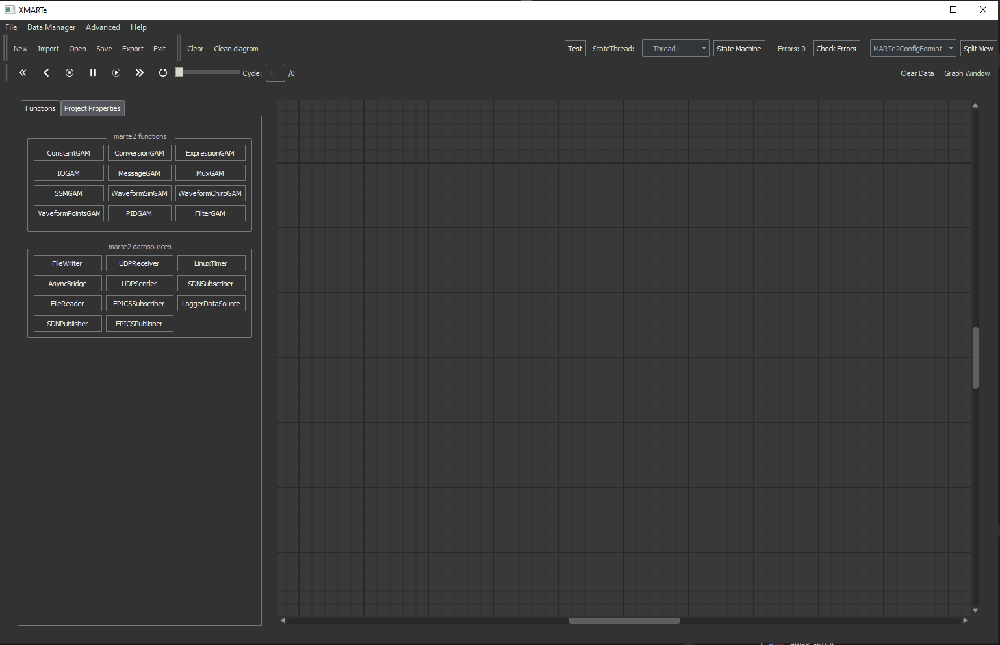

Getting Started
===============

Installing
^^^^^^^^^^

You should be able to install the application via pip install:

.. code-block:: bash

   pip install xmarte

You can then start the application as:

.. code-block:: bash

   python -m xmarte

Upon installation and startup it can take a little while to start up, around 5-10 seconds, this is normal as it loads dynamic data configurations and connects to services remotely if available.

Once loaded the application should appear as below:

