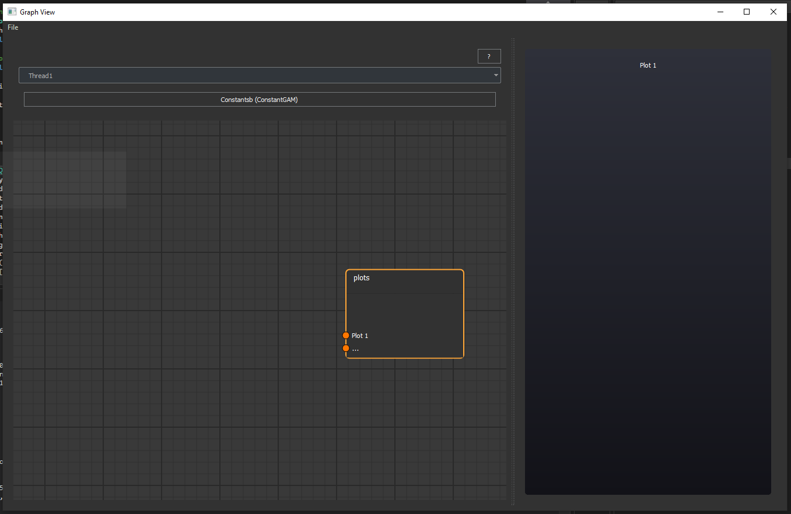
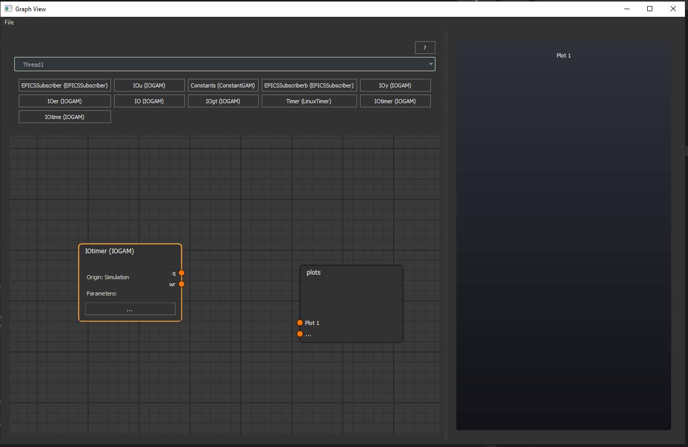
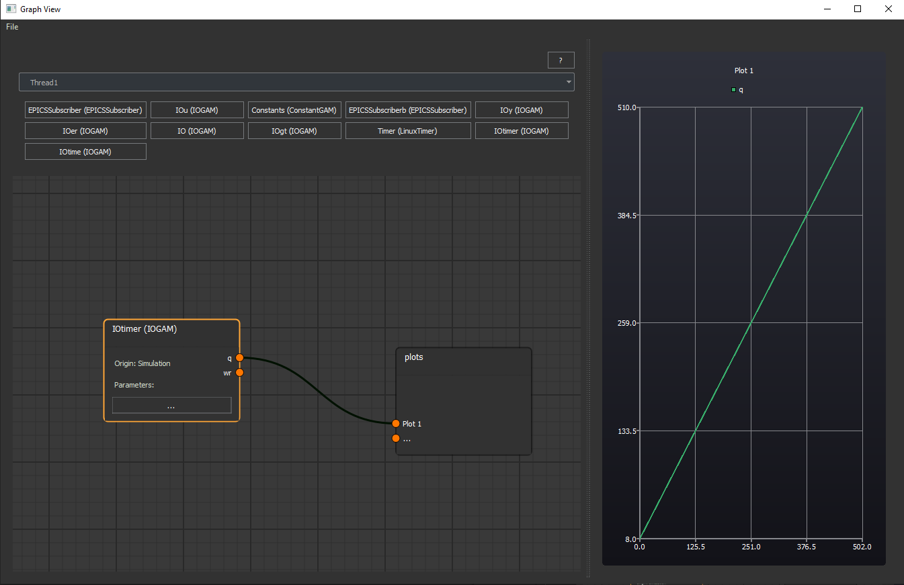
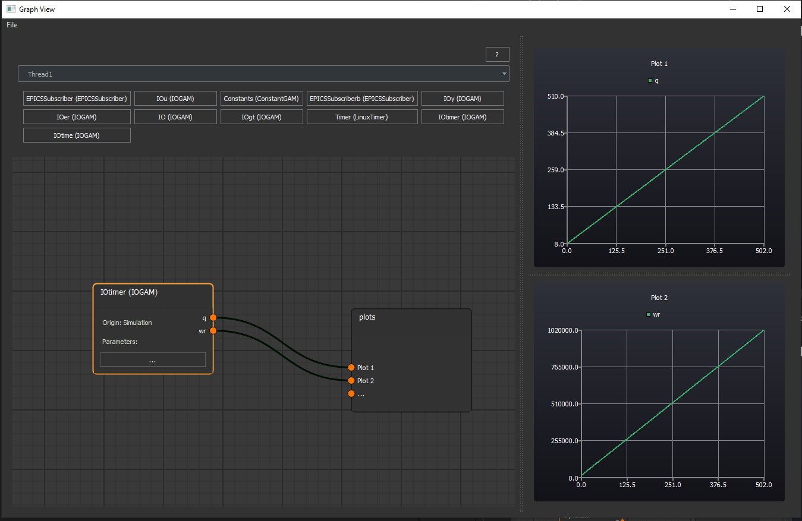

Graphing Tool
-------------

The graphing tool provides a window from which users can plot recorded data from MARTe2 executions either loaded into the application from the test simulation or by importing a CSV file.

In order to produce a plot, first select the thread and block from the MARTe2 application with the signal you wish to plot.

Next select the produced signal from the block, once that block has been added to the diagram, to the plot you wish to connect this signal to.

Connecting a signal to "..." on the plots node producing additional plot graphs.

.. note:: The file menu allows you to export and import plots to share data with others or even as an exported PDF document.