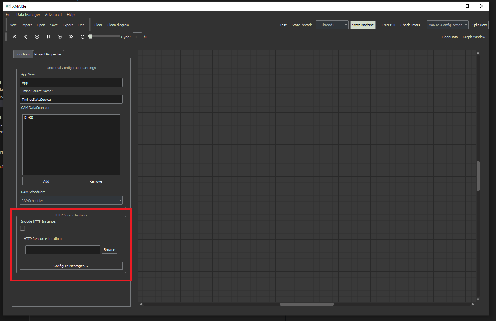
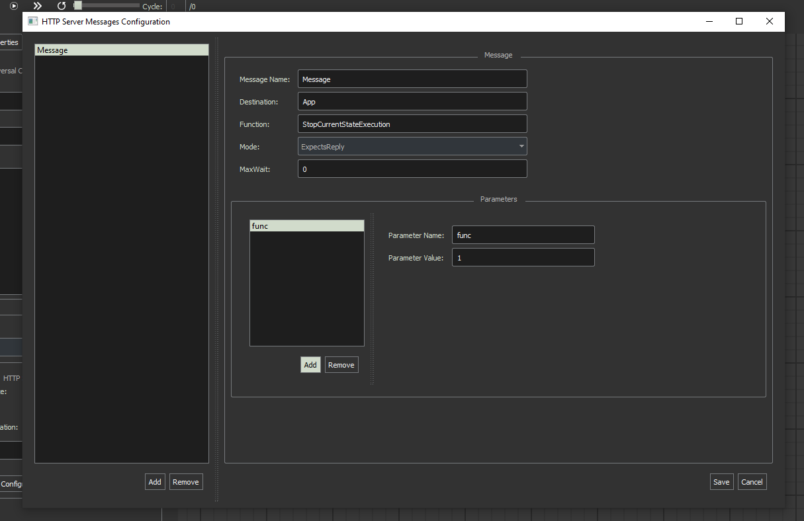
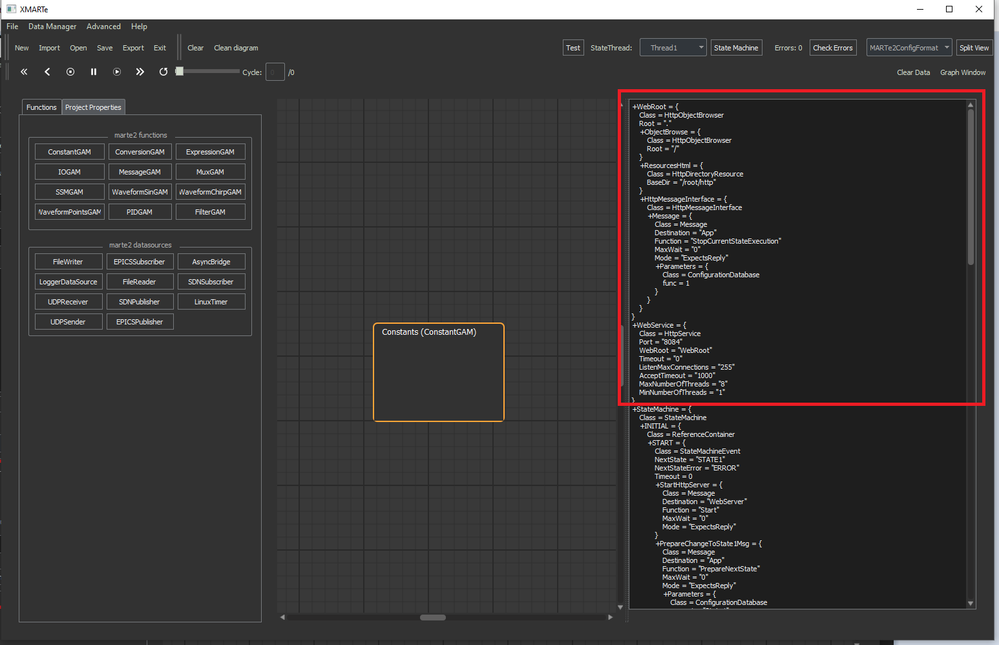

The HTTP Web Service Configuration:
===================================

The http web service can be configured from the left panel in the application under Project properties.

You can configure simple aspects of the HTTP Web Service such as the resources location and to configure messages.

The Message configuration window allows you to configure the set of messages sent when an event occurs.

From the message configuration window you can modify the settings of the message configuration corresponding to the MARTe2 Message Parameters.

.. note:: Parameters are configurable also here.

