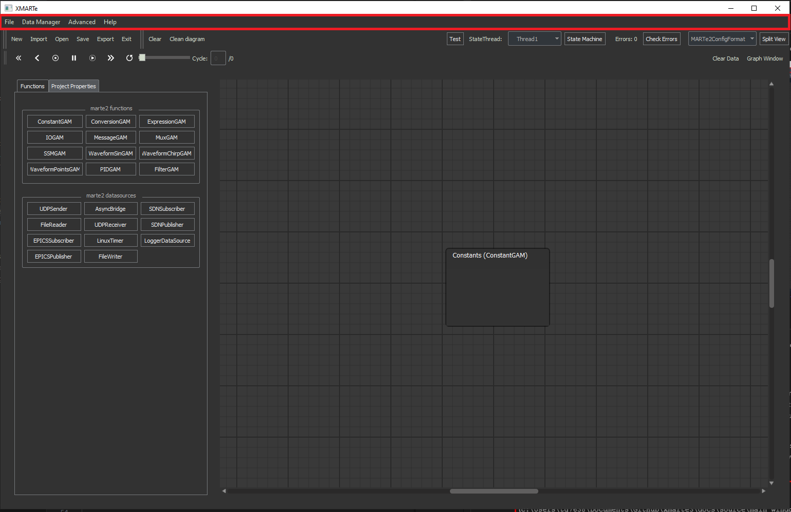
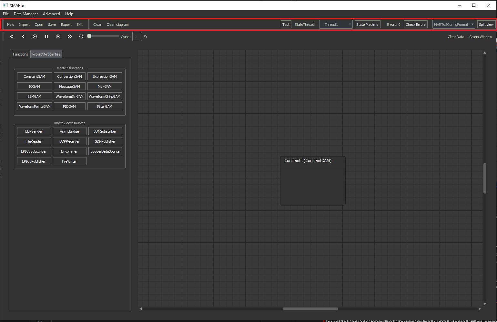
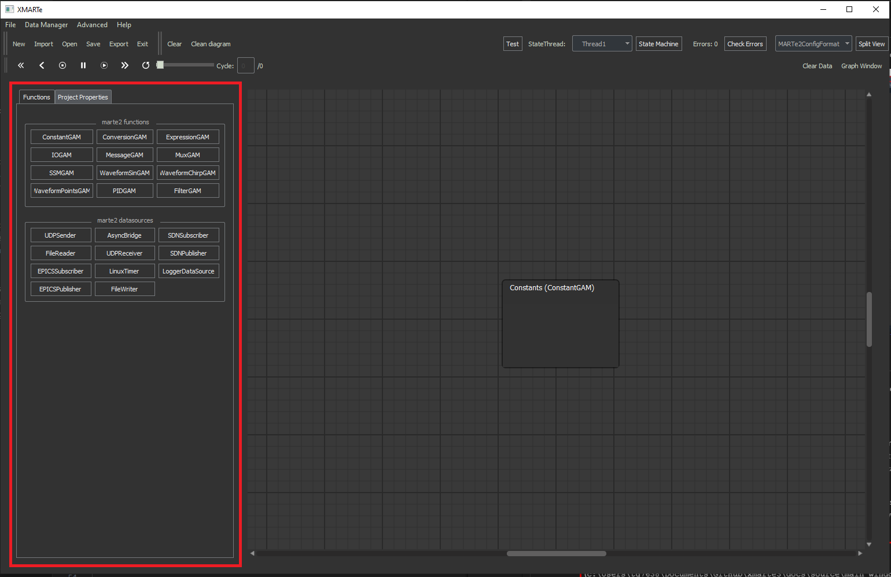
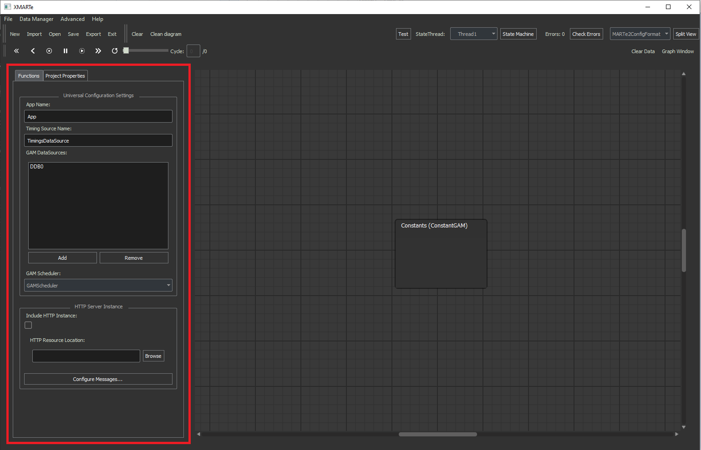
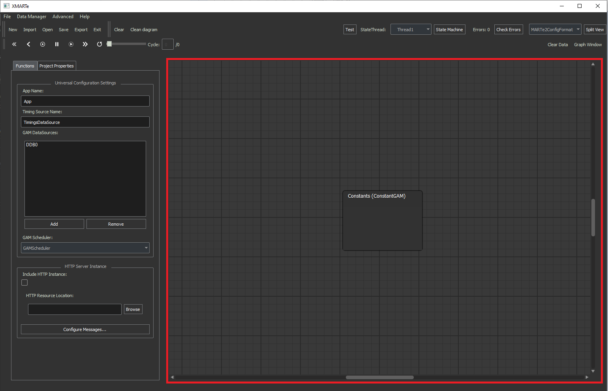
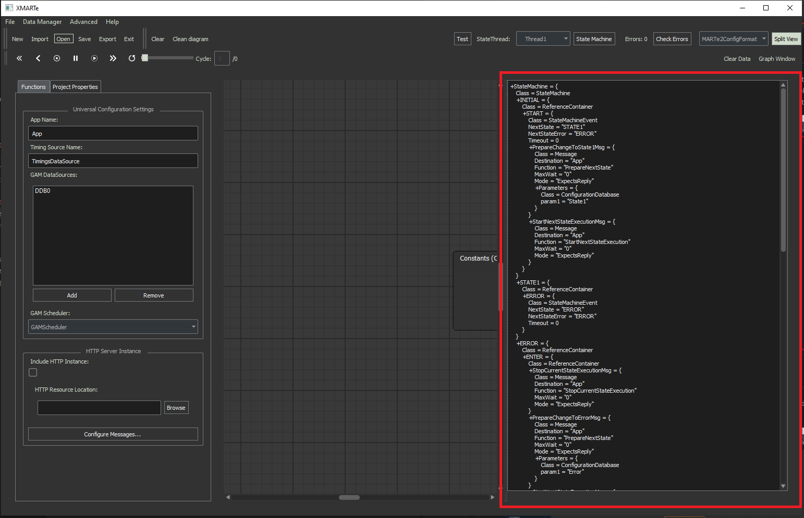
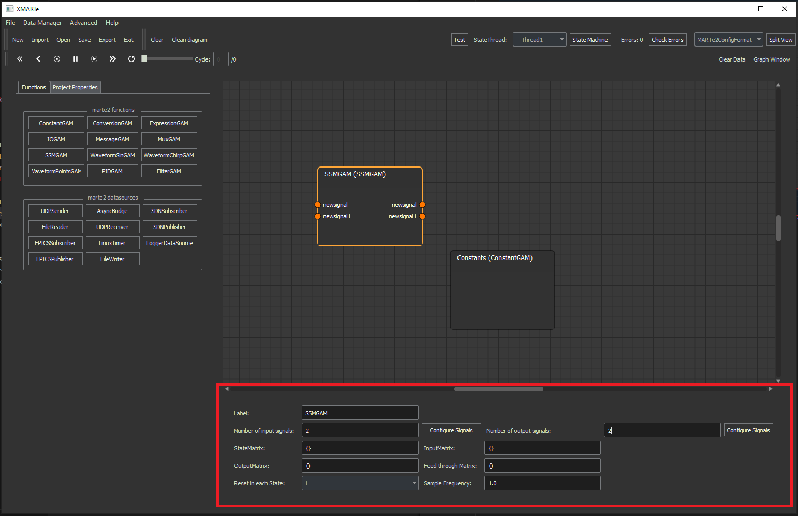

The Main Window
---------------

Menubar
^^^^^^^

The menubar is defined as below and provides several menu operation outlined in the below documentation `here <#menu-operations>`_.

Toolbar
^^^^^^^

The toolbar is defined as given below and gives standard functions on the left hand side including the file menu functions. The toolbar also includes the functions:

File Menu Operations
====================

* 
  New: clears the scenes of GAMs and DataSources, resets the project configuration and state machine to defaults.

* 
  Import: Allows you to import configuration from other supported formats such as .cfg.

*
  Open: Open a pre-existing GUI configuration from .xmt format.

*
  Save: Save the current GUI configuration to .xmt.

*
  Export: Allows you to export the configuration to any supported format, such as .cfg.

*
  Exit: Close the current application instance.

*
  Clear: Clears the current thread of all GAMs/DataSources.

* 
  Clean Diagram: This button attempts to organise the blocks within the thread diagram into a sensible order for readability. It uses the execution order grouping to group the blocks from left to right and then displays this top to bottom. This currently neglects whether edges overlap with graphical items in the diagram such as blocks or other edges.

Test Operations
===============

* 
  Test: This button will open the test simulation window.

State Machine Operations
========================

* 
  StateThread: Selects the state and thread to configure in the block diagram.

* 
  State Machine: Loads a window to allow you to configure the state machine, application states and threads.

Application Operations
======================

* 
  Check Errors: Opens a window which provides feedback on the current application errors.

* 
  Split View: Toggles the text based view of the .cfg output.

Data Operations
===============

* 
  Playback Buttons: When data is loaded into nodes by running a simulation or using Import Data from a matching CSV to the application, you can play the data in the diagram via this playback toolbar.

* 
  Clear Data: clears data from the existing application GAMs and DataSources.

* 
  Graph Window: Opens the graph plotting tool.

Block Panel
^^^^^^^^^^^

This panel includes all the available blocks you can add to the state and threads, either as GAMs or DataSources.

Project Properties
^^^^^^^^^^^^^^^^^^

This section allows you to configure the application properties where you can:

- Add/Rename/Delete GAM DataSources.
- Change the application name.
- Add and configure a HTTP Web Service.
- Set the Timing DataSource name.
- Set the application Scheduler.

Scene/Thread
^^^^^^^^^^^^^

The scene or otherwise referred to as the thread is the graphical representation of the thread that you build in the GUI. Sometimes called the scene to provide differentiation from this and other representations of the application such as the split view.

Split View
^^^^^^^^^^

The split view provides a secondary panel alongside the displayed scene which provides a textual representation of the application depending on the configured output file type to display. Options are MARTe.cfg and whatever additional formats are provided by plugins.

GAM/DataSource Configuration Bar
^^^^^^^^^^^^^^^^^^^^^^^^^^^^^^^^

The configuration bar provides the parameters of a GAM/DataSource and is accessible by double left clicking a block. Once displayed you can modify the parameters for the selected GAM/DataSource.

