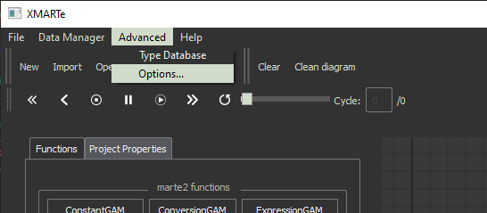
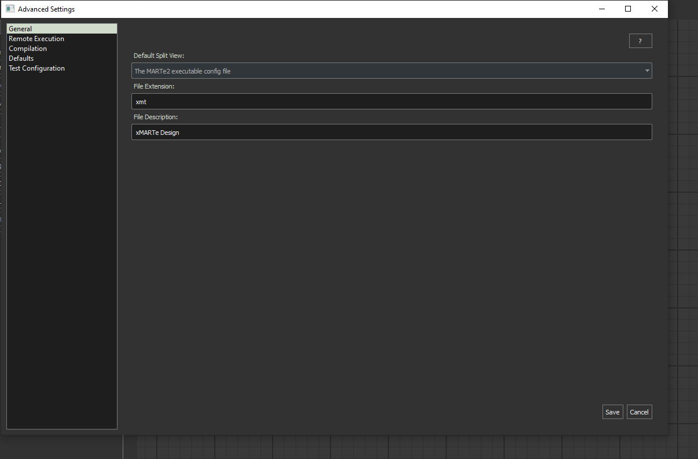
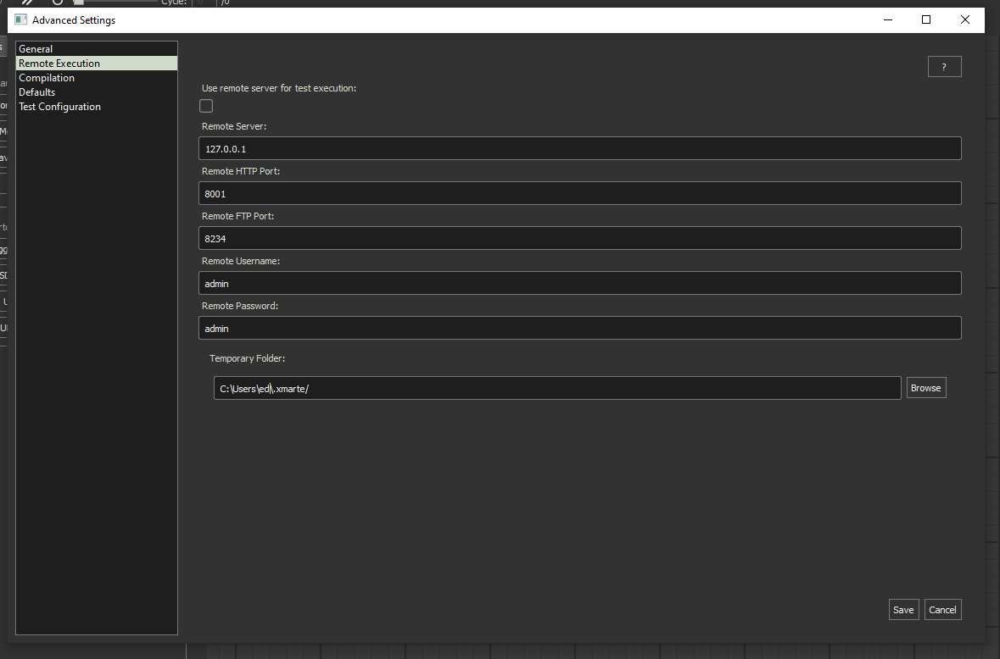
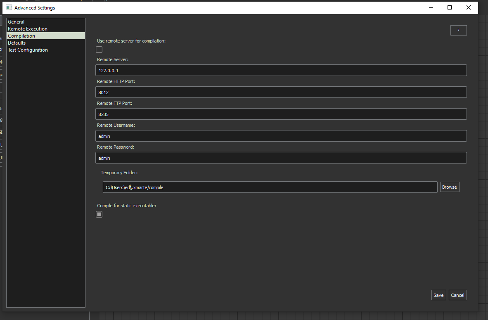
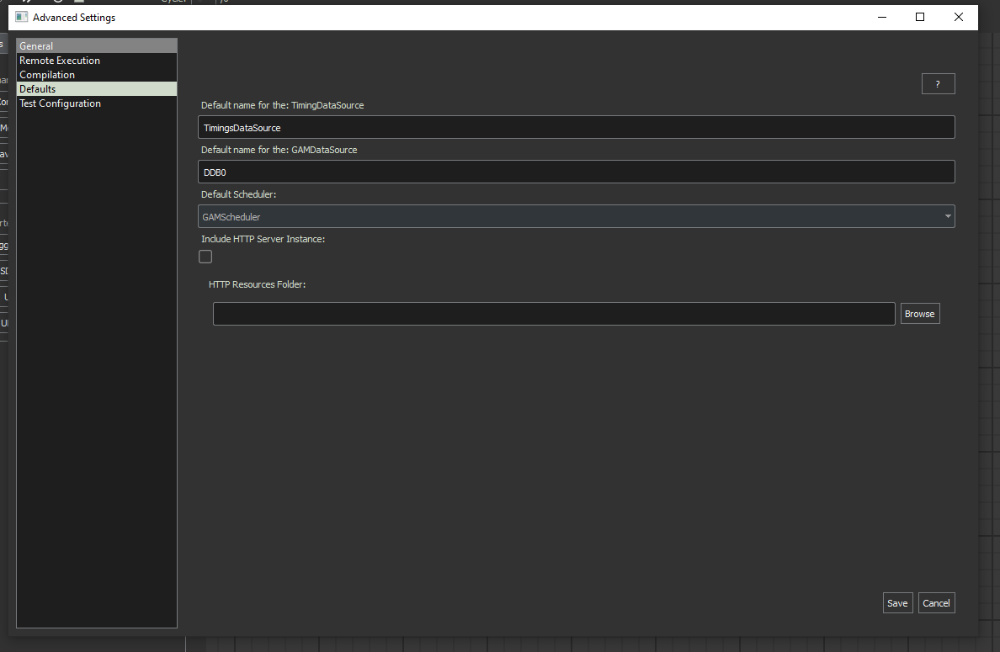
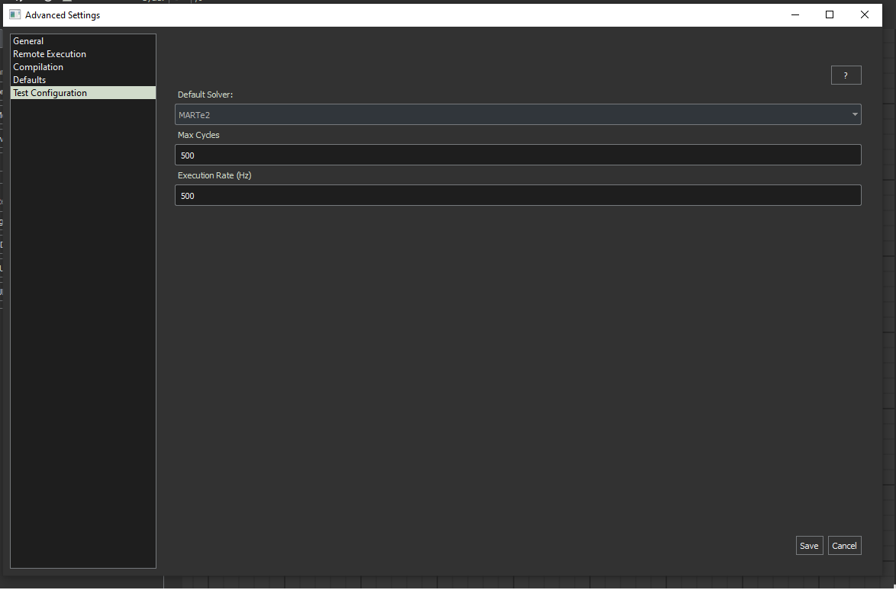

Advanced Settings
=================

Once you open the options menu there are five main panels you can configure application/service behaviour from.

.. note:: Plugins can add additional settings panels to the options window.

General Menu
^^^^^^^^^^^^

The General Menu allows you to configure defaults for the GUI format of storing and reporting the MARTe2 application configuration within the GUI.

- Default Split View: Configure the default file format displayed in the split view.
- File Extension: Configure the default file extension for storing GUI application configurations.
- File Description: Configure the description associated with application files.

Remote Execution
^^^^^^^^^^^^^^^^

The Remote Execution panel allows you to configure where test similations execute. The Password is stored in an encyrpted file but it is still not recommended to re-use other passwords for the passwords of remote runners.

.. note:: In order to execute simulations on remote systems you need a runner setup on that remote server, the firewall to allow incoming connections on these ports and a route available.

.. note:: To run a simulation locally you need WSL installed for windows with docker, for linux systems you just need docker installed.

- Use remote server for test execution: Configures whether to run test simulations locally or on a remote server.
- Remote Server: The IP address or hostname of the remote server for executing tests.
- Remote HTTP Port: The HTTP port the server is configured to listen on.
- Remote FTP Port: The FTP port the server is configured to host FTP on.
- Remote Username + Password: The credentials the remote server is configured to allow.
- Temporary Folder: The folder where test configurations are staged and if running locally, executed.

Compilation
^^^^^^^^^^^

Allows you to configure how types are compiled in the application from C++ libraries.

- Use remote server for compilation: Configures whether to run compilations locally or on a remote server.
- Remote Server: The IP address or hostname of the remote server for compiling.
- Remote HTTP Port: The HTTP port the server is configured to listen on.
- Remote FTP Port: The FTP port the server is configured to host FTP on.
- Remote Username + Password: The credentials the remote server is configured to allow.
- Temporary Folder: The folder where compilation files are staged and if running locally, executed.
- Compile for static executables: This is experimental and not yet implemented. It will be relevant in version 2 for whether to compile entire MARTe2 applications into static or shared builds.

Defaults
^^^^^^^^

This panel allows you to configure the defaults for MARTe2 configurations.

- Default name for the TimingDataSource.
- Default name for the GAMDataSource.
- Default Scheduler:
   - FastScheduler
   - BareScheduler
   - GAMScheduler
- Include HTTP Server Instance: Whether to include a HTTP WebService by default in MARTe2 applications.
- HTTP Resources Folder: The default HTTP Resources folder to use.

Test Configuration
^^^^^^^^^^^^^^^^^^

This panel allows you to configure the default values for a test configuration.

- Default Solver: This allows the user to configure the default solver. Only MARTe2 is currently available, in future versions python ODE will be made available alongside other options.
- Max Cycles: The maximum number of iterations before a simulation completes execution and returns the results.
- Execution Rate: The rate at which simulations should take place. Speeding this up could increase the speed to results but can lose data also.
