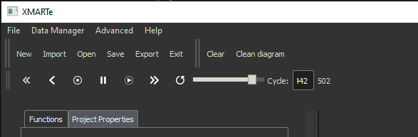
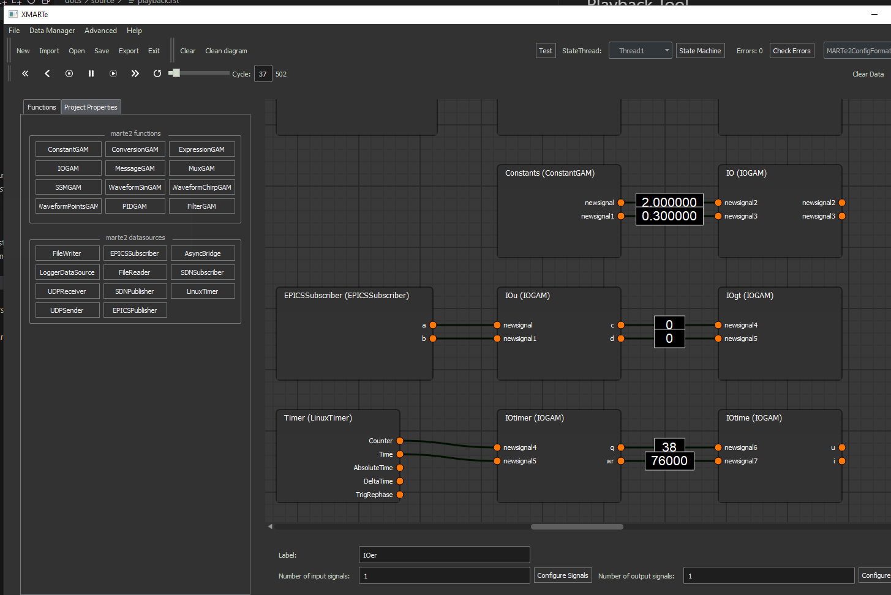

Playback Tool
=============

You can load data into the application by running a test simulation or by using the Data Manager to import a CSV file with columns named correspondingly to signal names.

Once data is loaded into the application, the playback toolbar is enabled.

The toolbar allows you to move forward, backwards, modify the speed of moving through the playback data. Restart, pause, stop and run as well as move to a specific point in the playback.

When playback is running, the data of a signal - permitting it is a fundamental signal, is displayed on the edge of the producer of that signal.

.. note:: You can remove the data from the application using the Clear Data button in the toolbar.