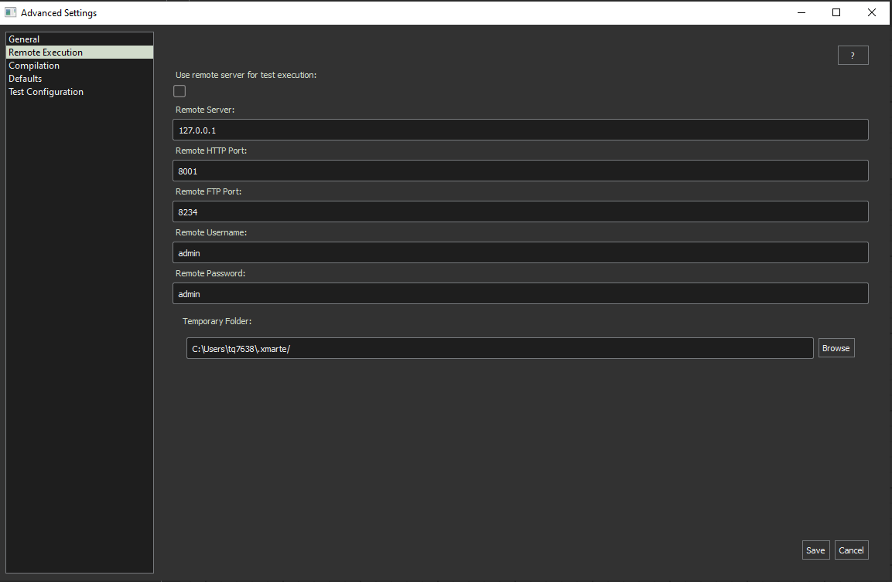
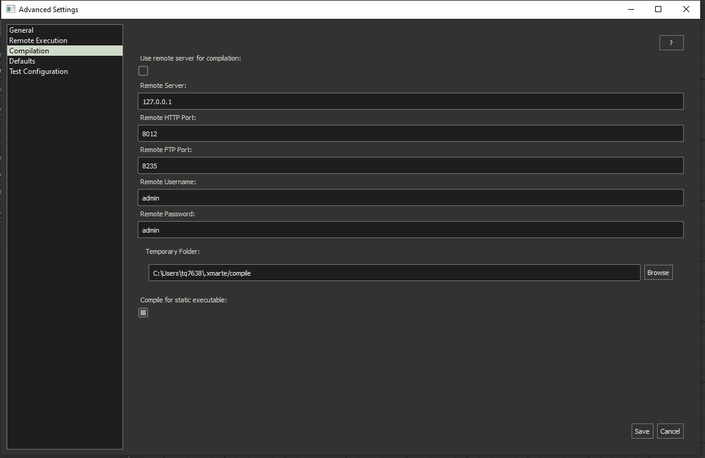

XMARTe Runners
--------------

xMARTe relies on external processes for performing make and MARTe2 operations. These are handled either locally where the user requires a machine with docker setup and available or remotely on a server setup with the runner packages built for xMARTe.

Simulation
^^^^^^^^^^

Installation
============

You can install this runner as instructed at it's repository available here:

https://git.ccfe.ac.uk/marte21/public/xmarte-runner

Configuration
=============

To configure to use a local or remote server, you can do so from Advanced->Options and then configuring from the GUI.

Compilation
^^^^^^^^^^^

Installation
============

You can install this runner as instructed at it's repository available here:

https://git.ccfe.ac.uk/marte21/public/marte-compiler

Configuration
=============

To configure to use a local or remote server, you can do so from Advanced->Options and then configuring from the GUI.

