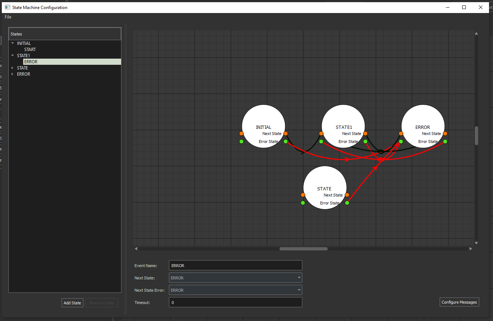

.. role:: raw-html-m2r(raw)
   :format: html

State Machine
-------------

The State Machine gives the user the ability to add/remove/configure states, threads and events within the state machine of the application.

Switching between state threads:
^^^^^^^^^^^^^^^^^^^^^^^^^^^^^^^^

You can switch between which thread is being modified within the application scene/diagram with the drop down box in the toolbar menu.

The State Machine Window
^^^^^^^^^^^^^^^^^^^^^^^^^^^^^^^^

Start by opening the state machine window from the toolbar option "State Machine".

The State Machine window itself:

Once here, you can add or remove states from the left panel:

You can add events to the state machine which control state transitions by right clicking states and selecting Add Event or right clicking an Event and selecting to remove the event.

State Configuration Window:
***************************

When you click on a state the right panel displays the state configuration window where you can add/remove threads and update the state name.

You can also configure the thread names as well as the CPU Mask to be used for their execution.

Event Configuration Window:
***************************

The event configuration panel appears when you select an event in the left hand panel.

The configuration panel allows you to modify the name of an event, the next state it transitions to, the state it transitions to upon error and the timeout.

.. note:: From here you can select to configure messages which configures the messages sent during an occurence of an event.

.. note:: Messages are auto generated when adding a new event, error events do not require message definitions as the State Machine object has a default set for any event named "ERROR".

Message Configuration Window:
*****************************

The Message configuration window allows you to configure the set of messages sent when an event occurs.

From the message configuration window you can modify the settings of the message configuration corresponding to the MARTe2 Message Parameters.

.. note:: Parameters are configurable also here.

State Diagram:
**************

The State diagram displayed in the State Machine Window provides a visual representation of the state machine configuration and transitions.

.. image:: _static/images/state_wnd.png
   :target: _static/images/state_wnd.png
   :alt: State Diagram

The red line shows where states proceed to during an error.

The black line shows an event transition from one state to another.

