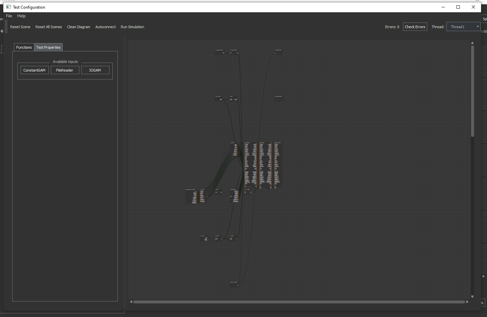
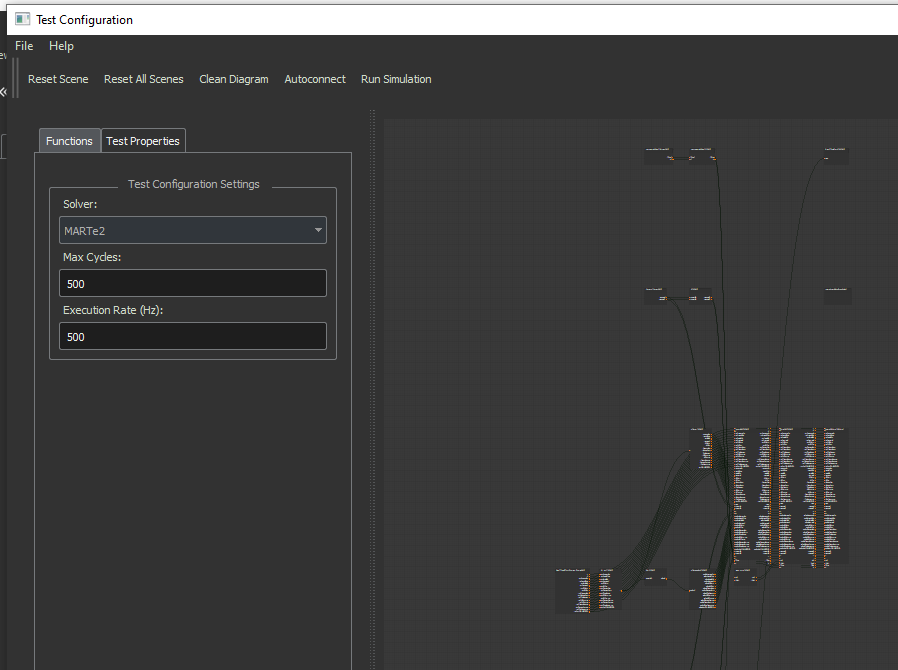
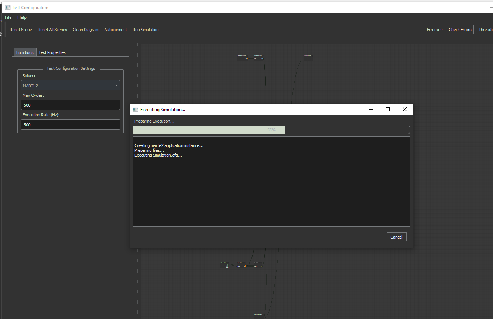

Test Simulation
===============

The GUI supports the ability to take a MARTe2 application that you have configured or imported and replace the datasources to and from the outside world and replace these with constant values.

You have the ability to replace constant signal inputs to your application then with file inputs for replaying recorded data or expected data.

The Test Simulation configures to record all signals throughout the execution of the application.

.. note:: In future versions we would like to support runnings models within simulations.

Post simulation the data from simulation is loaded into the node edges in the application and can be reviewed with the graphing or playback tool.

.. note:: Currently the diagram loads zoomed in to a empty space. Zoom out to find the configured diagram.

.. note:: The Test window can take some time to load as it generates a simulation config from your application configuration.

The File Menu allows you to save and load test configurations.

The toolbar provides the following options:

- Reset Scene: Reset the current thread to it's original test configuration.
- Reset All Scenes: Reset all threads to it's original test configuration.
- Clean Diagram: Order and organise the current threads blocks based on execution order.
- Autoconnect: Automatically connect signals with the same name and datasource where disconnected.
- Run Simulation: Execute the simulation on a local or remote instance.
- Errors: List the number of errors in the test configuration.
- Check Errors: List the error reasons for this test configuration.
- Thread Drop Down: Switch between threads to configure.

On the left panel you can add:

- ConstantGAM: to add constant signal inputs to the system.
- FileReader: To add file inputs to replace signals.
- IOGAM: Used to read from the FileReader and get the signal to the right datasource. Ensure you use this and the FileReader appropriately, i.e. only one IOGAM in one thread can read a FileReader datasource instance.

The Test Properties panel allows you to configure:

- Solver: This only allows MARTe2 for now which executes an actual run of the simulation. In future, additional solvers will be added.
- Max Cycles: The maximum number of iterations the test will execute for before returning the recorded outputs.
- Execution Rate (Hz): The rate to run the simulation, the faster the simulation, the faster to results but the higher likelihood of losing data to file storage limitations.

Once you are satisfied with your test configuration, select Run Simulation and the below window will appear and execute in the background the test.

Once completed, the window will close, you can then review the results by closing the test window and using either the playback tool or the graphing tool.
