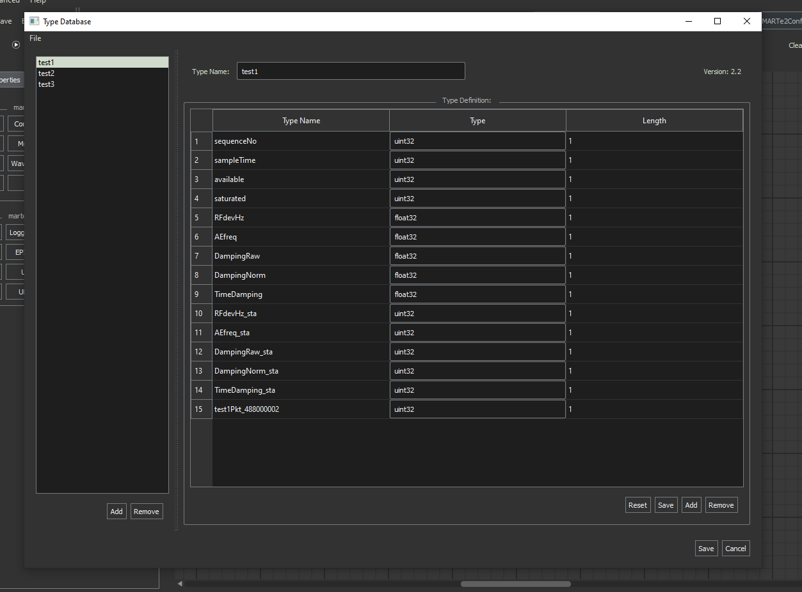
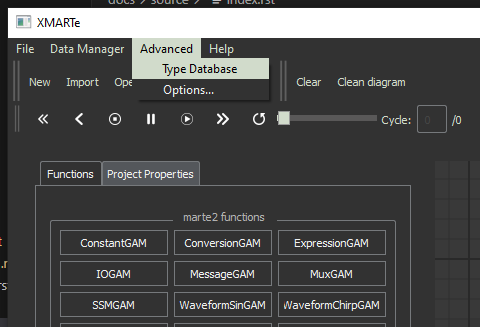
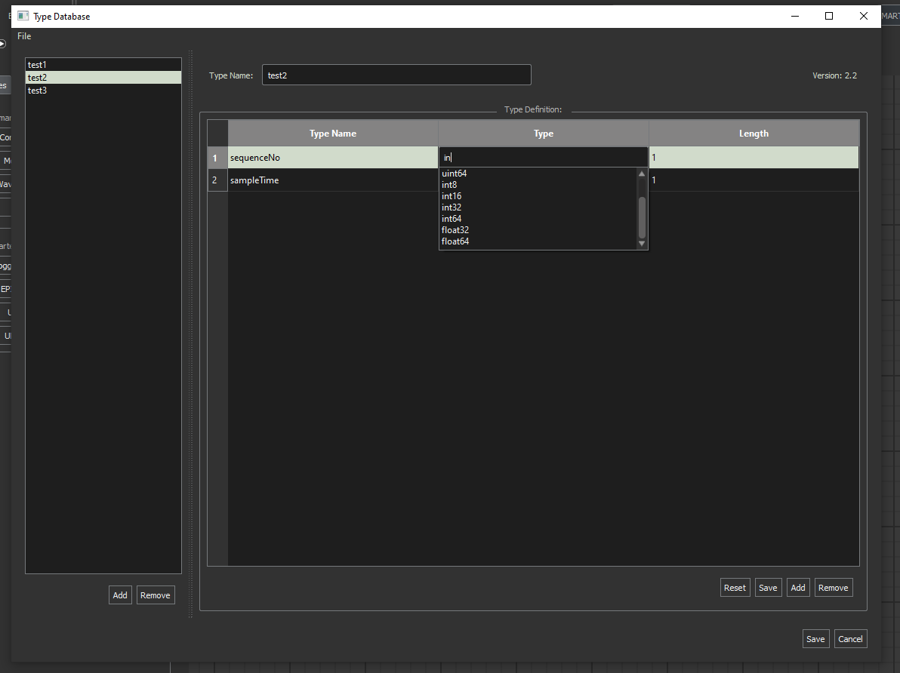

.. role:: raw-html-m2r(raw)
   :format: html

Type Library
------------

The type library provides the user with an interface to define complex types, further than the pre-existing fundamental types you get in MARTe2.

The basic types are defined as: https://vcis.f4e.europa.eu/marte2-docs/master/html/core/types/types.html?highlight=types

Opening the type database
^^^^^^^^^^^^^^^^^^^^^^^^^

You can open the type database from the main menu at Advanced->Type Database.

File Menu
^^^^^^^^^

The file menu operations allow you to:

*
  Import: You can import a set of header files stored within a directory to the type database.
*
  Export: You can export the type database to a directory as a set of header files.
*
  Exit: Exits the application

.. note:: The applicatin does not store types in MARTe2 compatible type definitions as those headers are highly complex. The MARTe2 compatible headers are generated during the compilation stage.

Adding/Removing types
^^^^^^^^^^^^^^^^^^^^^

You can add or remove types from your type database via the buttons indicated below.

.. image:: _static/images/type_database_addtypes.png
   :target: _static/images/type_database_addtypes.png
   :alt: Type Database Window

You can select to rename a type in the type name and then configure the elements of a type with the type definition panel section.

.. note:: You cannot modify the Version number, this is automatically incremented whenever you make a change to a type and save it. Old versions are backed up in an internal archive available at ~/.xmarte/type_db/archive.

Configuring a Type
^^^^^^^^^^^^^^^^^^

.. image:: _static/images/type_config.png
   :target: _static/images/type_config.png
   :alt: Type Configuration

To configure a type you can use the buttons below to:

*
  Reset: the type to it's initial definition from previous save.
*
  Save: Save the current type definition, increments the version name and backs up the old version to an internal archive.
*
  Add: Adds a new element to the type definition.
*
  Remove: removes the selected elements in the configuration panel from the type definition.

The type selection is auto-populating to give the user a definitive list of available types.

.. note:: the type selector loads existing complex types from within the type database as well as fundamental MARTe2 types.
