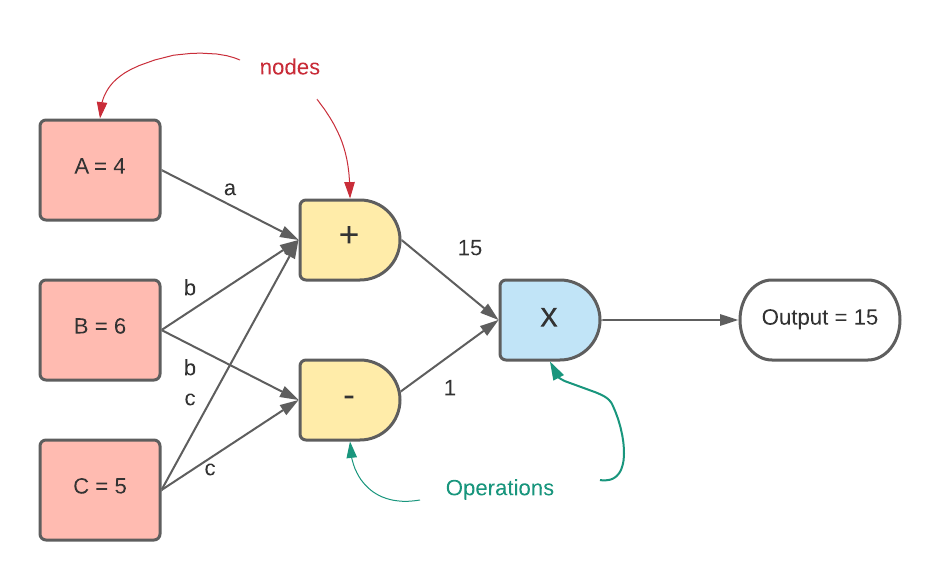

.. MARTe2-python documentation master file, created by
   sphinx-quickstart on Mon Dec 13 15:26:17 2021.
   You can adapt this file completely to your liking, but it should at least
   contain the root `toctree` directive.

Welcome to MARTe2-Pythons documentation
============================================

This repository holds the pythonic representatiuons of MARTe2 components and provides you with
an interface to define a MARTe2 application programmatically in python.

As well as this it also provides functions and classes capable of producing not only a MARTe2 configuration
but also a simulated version where it replaces all inputs into the system via any datasource with instead a file input
to replace specific signals if provided, or alternatively as a constant value (default 0).

The purpose of this documentation is to provide the user with a description on how to create an application in python for MARTe2.
And subsequently also a simulated version of the application.

.. toctree::
   :maxdepth: 1
   :caption: Contents:

   getting_started
   Water Tank Example <water_tank>
   Complex Objects <complex>
   Cfg Reader <reader>
   The Simulation Framework <simulation>
   The Type Database <type_db>
   Using The Factory <factory>
   Adding New Components <components>
   Useful Functions <functions>
   Related <related>
   Support <support>

MARTe2 Setup
===============

It is expected that you already have MARTe2 and MARTe2-Components built. We recommend you follow the procedure defined here:

`MARTe2 Setup Instructions <https://vcis-gitlab.f4e.europa.eu/aneto/MARTe2-demos-padova/-/blob/master/README.md?ref_type=heads>`_

MARTe2 is a block based methodology of defining a real time control application
and can be hard-coded in C++ to create static binaries or as a configuration file
parsed at startup which defines the blocks and subsequent connections between blocks.
MARTe2 is compatible with multiple systems spanning linux distributions to barebone
metal whereby there is no operating system.

This method in computing of describing the flow of data through a system and operations
is commonly compared to graphing, an illustration below shows a simple application which
performs arithmetic operations on several constant values as input to compute the output of 15.

If you navigate to the getting started section there is a walk through of creating a very simple application.

This documentation shall guide the user through creating a MARTe2 application from python.
