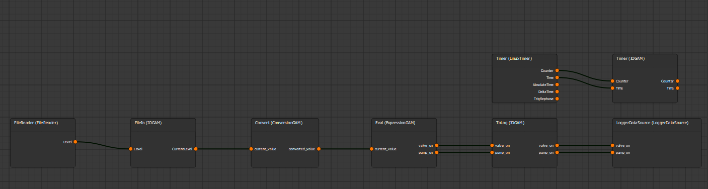
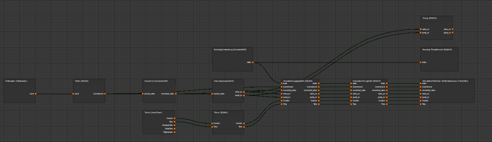

.. MARTe2-python documentation
   Started on Tue Dec 14 2021.
   You can adapt this file completely to your liking, but it should at least
   contain the root `toctree` directive.

Simulation Framework
====================

.. toctree::
   :maxdepth: -1

The simulation framework is a class that provides the capability to take a pre-defined MARTe2Application instance and create a simulated
version of the application where outputs are instead logged rather than transmitted outside the context of the application and inputs are replaced by constant values.
Afterwhich you can replace these with user defined overrides or by a file input which provides set values for specified signals.

This is particularly useful when developing, debugging and testing your applications. When you process your MARTe2Application you get a constant input system,
where all signals are recorded alongside the AbsoluteTime and Count per MARTe2Application iteration in CSV format as output.csv. You can chose to modify this as
is does in the XMARTe2 GUI, by replacing signals from the Constant Input with your preferred inputs (e.g FileReader as playback or expression/simulation wrappers as models).

In order to process your application, simply take your definition as marte_app_def and:

.. code:: python

    from martepy.frameworks.simulation_frameworkv2 import SimulationGenerator

    # Suppose our MARTe2Application object is already defined as marte_app_def
    sim_generator = SimulationGenerator(marte_app_def) # (Setup initial definition)
    sim_generator.configure(marte_app_def) # (Resets internals)
    sim_generator.simulation_app.config['maxcycles'] = 500 # (Number of Iterations)
    sim_generator.simulation_app.config['timefrequency'] = 500 # (Hz)
    sim_app_def = self.sim_generator.build() # (finally build the simulation)

The simulation generator works by maintaining an original copy of the marte_app_definition and when it initializes
it runs a deepcopy of the application and names this simulation_app for modifying in the build function.

Here you can modify maxcycles and timefrequency in the MARTe2Application application definition prior to a build to control how fast the simulation runs and for how long.

The `XMARTe2 GUI <https://git.ccfe.ac.uk/marte21/xmarte>`_. provides a great visual of how this works. Let's take the water tank example as this uses a FileReader input,
in python, you might use the Reader function to read your .cfg pre-generated and make this into an app.

The simulated built version then looks like:

*Note: FileReaders as maintained between the application and simulation, a example showing SDN input however would be replaced by a FileReader*

*Note: You must then create your CSV file that replaces the signals*