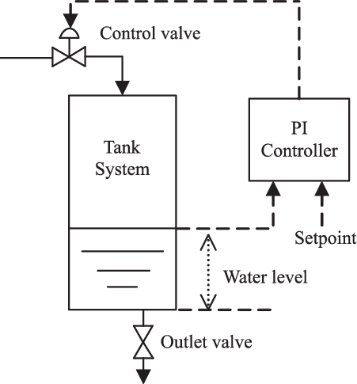
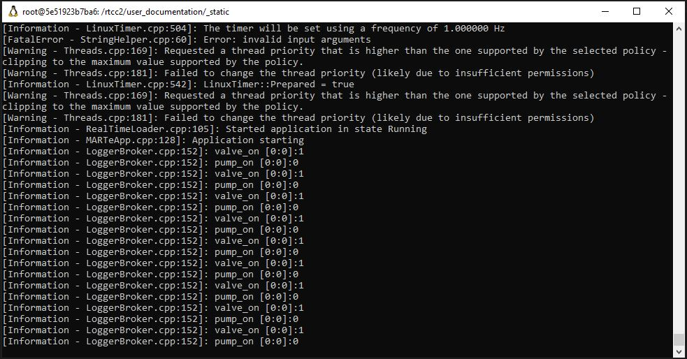

.. MARTe2-python documentation
   Started on Tue Dec 14 2021.
   You can adapt this file completely to your liking, but it should at least
   contain the root `toctree` directive.

The Water Tank Example
======================

In this example we will try to maintain the level in a water tank using MARTe2 and define it from python using the repository.

For our application we shall take input from a CSV file which will simply give us a measurement of a water tank. For our application we will have:

- Setpoint for what water level we want to achieve
- Two outputs - one to lower the tank water level and one to run the pump to fill the water tank as described in the figure 1.
- Current measured value (provided by our CSV input)

For our application we won't have a great deal of control, the valve and pump will still be an on or off. In reality you would probably work with an actuator with some level of precision.

Starting with the CSV file, which can be found under `CSV File <./_static/water_tank.csv>`_, it gives us format:

.. list-table:: #Level (float64)[1]
   :header-rows: 1

   * - Values
     - 50
   * - 
     - 49
   * - 
     - 48
   * - 
     - "... (continues)"

There are some basic parts necessary for a MARTe2 config to run, firstly it needs a timer to define what frequency the application should iterate. For ours, we'll set this to
1 Hz so we can visually appreciate the application but in reality you can run this much faster.

With that in mind, we'll also add a LoggerDataSource and read on the terminal the status of the pump control and outlet valve.

To get started let's write up our python file with some of the basic imports and definition of a MARTe2-Application.

.. code:: python

    
    from martepy.marte2 import (
        MARTe2GAM,
        MARTe2Application,
        MARTe2RealTimeThread,
        MARTe2RealTimeState,
        MARTe2GAMScheduler
    )

    from martepy.marte2.gams import (
        IOGAM, 
        ExpressionGAM,
        ConversionGAM
    )

    from martepy.marte2.datasources import (
        LinuxTimer,
        LoggerDataSource,
        TimingDataSource,
        FileReader,
        GAMDataSource
    )

    app = MARTe2Application()
    # Define our DDB0 database
    app.add(additional_datasources = [
        GAMDataSource(configuration_name = '+DDB0')])

The first thing to know about our application object is that there are 2 main attributes to the application that you utilise to define your configuration:

- Functions: This is the list of MARTe2 GAM Objects that are executed by the user.
- Additional Datasources: This attribute comprises of a list of MARTe2 DataSource objects that are used in the application.

So for our water control application, we'll first need to get our signal input from the CSV file. For this we can use the FileReader Datasource, which we can include with:

.. code:: python

    file_input = [("Level", {'MARTeConfig':{'Alias': 'Level', 'DataSource': 'FileReader', 'Type': 'float64'}})]
    reader = FileReader(configuration_name = '+FileReader',filename='water_tank.csv', output_signals=file_input)
    app.add(additional_datasources = [reader])

.. note:: There are more parameters which we'll keep to the default.

Now that we have our signal inputs which will act like what in reality would be a different datasource, namely SDN or UDP where you are actually receiving this data from a sensor on your network.

Next lets assume our Set Point is 40 and we will use the Expression_GAM then to evaluate the input value and output to our pump/valve based on the current level.

To do this, first examine the documentation of the GAM provided `here <https://github.com/aneto0/MARTe2-components/blob/master/Source/Components/GAMs/MathExpressionGAM/MathExpressionGAM.h>`_.

So if we define our expression as:

- valve_on = current_value > (uint8)40;
- pump_on = current_value < (uint8)40;

Now that we know our expressions, let's add in our Expression_GAM and connect it to the FileReader outputs using an IOGAM.

.. note:: Because of the nature of the FileReader Datasource, it can only be read into your DDB via an IOGAM and you cannot have multiple IOGAMs accessing the FileReader.

The format of a signal in our pythonic code is represented as a tuple where the first value is the string name of the signal. The second component contains a dictionary with only key 'MARTeConfig' and value is another dictionary
which contains additional information about the signal such as Alias, Type, DataSource, NumberOfElements, NumberOfDimensions.

.. note:: You don't need to define all possible signal details in the dictionary.

The format of the dictionary in python for a simple signal is thereby:

.. code:: python

    signal = ("Signal1", {'MARTeConfig':{'Alias': 'OurSignal', 'DataSource': 'DDB0', 'Type': 'float64'}})

.. note:: All information should be in string format.

Because the ExpressionGAM uses a MathExpression Parser which is incomplete for some specific operations we need to convert the float64 value into uint8 first and use it as uint8 as logical operations require this.

Thankfully our signals don't exceed 256 in value so it will be a lossless conversion using the ConversionGAM.

Now that we know this, we can go ahead and add our three GAMs to the network:

.. code:: python

    # Define our IOGAMs input and output signals.
    file_to_db = [("CurrentLevel", {'MARTeConfig':{'Alias': 'CurrentLevel', 'DataSource': 'DDB0', 'Type': 'float64'}})]
    # Create the IOGAM and add it to our application
    app.add(functions=[IOGAM('+FileIn', file_input, file_to_db)])
    # Convert our signal
    input_signals = [("current_value", {'MARTeConfig':{'Alias': 'CurrentLevel', 'DataSource': 'DDB0', 'Type': 'float64'}})]
    output_signals = [("converted_value", {'MARTeConfig':{'DataSource': 'DDB0', 'Type': 'uint8'}})]
    app.add(functions=[ConversionGAM('+Convert',input_signals,output_signals)])
    # Define our Expression
    expression = '''
    valve_on = current_value > (uint8)40;
    pump_on = current_value < (uint8)40;
    '''
    input_signals = [("current_value", {'MARTeConfig':{'Alias': 'converted_value', 'DataSource': 'DDB0', 'Type': 'uint8'}})]
    output_signals = [("valve_on", {'MARTeConfig':{'DataSource': 'DDB0', 'Type': 'uint8'}}),
                      ("pump_on", {'MARTeConfig':{'DataSource': 'DDB0', 'Type': 'uint8'}})]
    app.add(functions=[ExpressionGAM('+Eval',input_signals,output_signals,expression)])

Okay great, so now our application has a setup like this:

.. graphviz::

   digraph example {
       rankdir=LR;  // Left to Right orientation

       FileReader [shape=box, label="FileReader"];
       FileIn [shape=box, label="FileIn"];
       Convert [shape=box, label="Convert"];
       Eval [shape=box, label="Eval"];

       FileReader -> FileIn -> Convert -> Eval;
   }

Great! Now our valve_on and pump_on signals need somewhere to go, in reality you would likely publish these values out on to a network to communicate with your actuators.

Now that we have this, let's define our Timer and Logger DataSources:

.. code:: python

    app.add(internals = [
                MARTe2GAMScheduler(
                    configuration_name = '+Scheduler',
                    timing_datasource_name = 'Timings',
                    class_name = "GAMScheduler"
                ),
            ])
    app.add(additional_datasources = [
                TimingDataSource(configuration_name = '+Timings'),
            ])
    
    app.add(additional_datasources = [
                LoggerDataSource(configuration_name = '+LoggerDataSource'),
            ])

    input_signals = [("valve_on", {'MARTeConfig':{'Alias': 'valve_on', 'DataSource': 'DDB0', 'Type': 'uint8'}}),
                     ("pump_on", {'MARTeConfig':{'Alias': 'pump_on', 'DataSource': 'DDB0', 'Type': 'uint8'}})]
    output_signals = [("valve_on", {'MARTeConfig':{'DataSource': 'LoggerDataSource', 'Type': 'uint8'}}),
                      ("pump_on", {'MARTeConfig':{'DataSource': 'LoggerDataSource', 'Type': 'uint8'}})]
    
    app.add(functions=[IOGAM('+ToLog', input_signals, output_signals)])
    
Now we need to define our run rate:

.. code:: python

    input_signals = [("Counter", {'MARTeConfig':{'DataSource': 'Timer', 'Type': 'uint32'}}),
                    ("Time", {'MARTeConfig':{'DataSource': 'Timer', 'Type': 'uint32', 'Frequency': '1'}})]
    output_signals = [("Counter", {'MARTeConfig':{'DataSource': 'DDB0', 'Type': 'uint32'}}),
                    ("Time", {'MARTeConfig':{'DataSource': 'DDB0', 'Type': 'uint32'}})]
    timer = LinuxTimer(configuration_name='+Timer')
    app.add(additional_datasources=[timer])
    app.add(functions=[IOGAM('+Timer', input_signals, output_signals)])

.. note:: Documentation on the Linux Timer can be `found here, <https://github.com/aneto0/MARTe2-components/blob/master/Source/Components/DataSources/LinuxTimer/LinuxTimer.h>`_

Finally now that we have put this altogether we can complete our application definition:

.. code:: python

    app.add(states=[
            MARTe2RealTimeState(
                configuration_name='+Running',
                threads=[
                    MARTe2RealTimeThread(
                        configuration_name='+Thread0',
                        cpu_mask=16,
                        functions=app.functions,
                    ),
                ],
            ),
        ])
    

    file_contents = app.writeToConfig()

    with open('water_tank.cfg','w') as outfile:
        outfile.write(file_contents)

You can find this as a `complete example here <_static/examples/water_tank.py>`_

You can also find the cfg that this `generated here <_static/water_tank.cfg>`_

The required CSV file is `available here <_static/water_tank.csv>`_

If you run the python script and then execute the generated MARTe2 config, you should get the following:

So great! We have used python to generate a MARTe2 configuration and then execute said application based on our simple example.

Next steps:

- It is encouraged to read up on the `simulation framework <./simulation.html>`_.
- Alot of operational functions and configurations were ignored in this example, the default set up is usually adequate for an application but you may want to review the other `examples available <https://github.com/ukaea/MARTe2-python/tree/main/examples>`_.